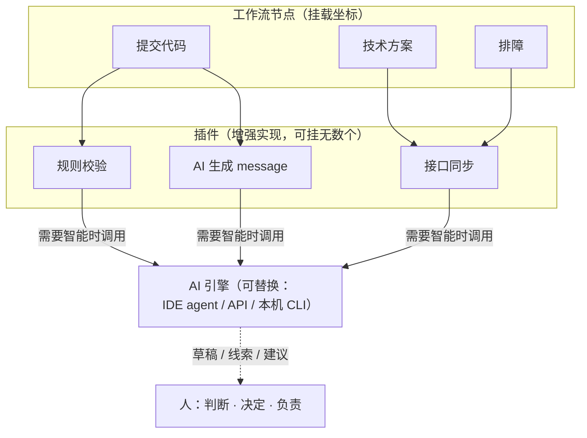

# fxDevKit 产品定义

> 本文描述产品当前形态，随产品持续迭代更新，不存在最终版。
> 最后更新：2026-09-15

> 本轮更新要点（与作者对齐后的定稿表述）：
> - **§一 产品是什么**：定位重写——任何工种的工作流节点都可以被插件增强；节点是挂载坐标，一个节点可被无数插件增强；AI 是插件可调的引擎；三种触发方式是并列的一等入口
> - **§三 两条铁律**：不变；「内核不含领域语义」补充 AI 引擎同理——内核不认识任何具体 AI
> - **§八 边界**：对话触发从「演进方向」升格为一等入口（入口层扩展，内核调度不变）；其余不变
> - 文档地图与导航参考 [`README.md`](../README.md)

---

## 一、产品是什么

**任何工种都有其工作流，任何工作流的节点都值得被增强。**

**人是来做判断和创造的；节点背后那些"不得不做但不想做"的琐碎，交给 AI。**

fxDevKit 是承载这些增强的底座：

- **节点是挂载坐标。** 一个节点（提交、技术方案、联调、排障……）背后可以挂**无数个插件**——规则校验、AI 生成、关联同步……插件是节点增强的具体实现，节点是它们的位置。
- **AI 是引擎，fxDevKit 是传动系统。** 我们不造 AI——IDE 里的编码 agent、大模型 API、本机 AI CLI 都是现成引擎。fxDevKit 解决引擎之外的四件事：**时机**（何时触发）、**上下文**（把 diff/文档/日志组织好交给增强）、**兜底**（增强失败绝不妨碍人做事）、**积累**（增强沉淀为插件资产，随人成长）。
- **判断永远在人。** AI 产草稿、出线索、给建议；决定权、责任、最终判断是人。增强不是替代，是放大。

三种方式触发增强——**三者是并列的一等入口**，都通向同一个调度内核：

| 入口 | 怎么触发 | 例子 |
|---|---|---|
| **主动触发** | 你敲命令 | `fxdevkit commit-msg gen`、`fxdevkit api sync` |
| **自动触发** | 动作发生时 hook 监听执行 | 提交时自动改写 message |
| **对话触发** | 你说一句话，AI 理解意图后触发对应能力 | "查一下线上日志，基于这个 reqId 为什么报这个错" |

**入口会增员，内核不换血。** 新增一种触发方式是入口层扩展，调度内核的"发现 → 装载 → 授权 → 派发 → 兜底"不变。

一张图看这三个概念的关系：



### 当下：用它的这个人是个研发

第一个验证场是作者自己的研发工作流——code 链路（需求评审 → 方案 → coding → 自测 → 联调 → 测试 → 上线）、线上排障、业务咨询、技术沉淀。第一个插件做 commit，因为它是眼下最高频的节点。

**这是需求的当下状态，不是产品的边界。** 任何工种的工作流都由节点组成——换工种、换目标，思路不变：换节点、换插件，底座不动。

### 换目标，不换产品

目标是会变的——今天是研发工作流，明天可能是带团队、做设计。工作流会变，"节点 × 增强"这件事不变。

| 人的工作流 | 需要的插件 |
|---|---|
| 研发：提交、方案、联调、排障 | plugin-commit-rules、AI 生成 message、接口同步、日志解释…… |
| 别的工种 | 将来的事 |

**换目标 = 换插件，内核一行不动。** 这不是巧合，是内核刻意不含任何领域语义的直接结果（见 §三）。同理，内核也不认识任何具体的 AI——引擎可替换，传动系统不依赖某个引擎的形状。

### 为什么需要统一挂载点

增强需求会持续出现，但落地方式通常是零散的：一段 hook 脚本、一条 lint 规则、一个 CI 步骤、一个自己写的命令行小工具。每加一种增强，就要重新接一次。

零散增强有三个固定代价：

- **重复** —— 每种增强都要自己解析一遍上下文、自己读一遍配置、自己实现一遍日志
- **不一致** —— 有的失败会阻断动作，有的静默放行，行为无法预期，也无法统一约束
- **不可见** —— 发生过哪些增强、命中了什么规则、改了什么内容，没有统一记录，事后无从追溯

fxDevKit 提供的是**统一挂载点**：接入一次，后续增强以插件形式挂载，共享上下文解析、配置分层、事件记录与失败策略。

与通用 AI agent 的关系：agent（如 ZCode/Claude）是通用的、会话式的，每次都要重新交代上下文；fxDevKit 把"针对某节点的增强"**固化**下来——模板、上下文获取、触发时机、兜底、记录都预先配置好，让增强从"每次手工召唤"变成"节点自带能力"。fxDevKit 是 agent 的固化层与挂载层，不和它竞争。

由此得出一条重要的定位区分：

> **fxDevKit 的价值不在于某一种增强能力比专用工具更强，而在于增强能力的组织与供给方式更优。** 单个插件完全可能打不过某个领域的专业工具——这不是问题，因为插件可以替换、可以升级、也可以被更好的实现取代，挂载点本身不受影响。

### 第一个插件只是验证载体

选择 commit 作为第一个插件，是因为它是当下最真实、最高频的节点，并且能端到端跑通"发现 → 装载 → 派发 → 兜底"全链路。

它的作用是验证架构，不是作为拳头功能去和单点工具竞争。因此评判它的标准不是"是否比某个专用工具更锋利"，而是**跑通之后，加第二个插件的边际成本是否足够低**。

---

## 二、产品形态

```
npm install -g @fxdevkit/cli      全局安装，任意仓库可用
~/.fxdevkit/config.yaml           用户自定义覆盖（跟人走，跨升级保留）
```

lark-cli 在形态上可作为参照：全局安装、核心配置落在用户目录、自带诊断命令。但 fxDevKit 与它有一个本质区别——**lark-cli 的能力是官方内置实现，fxDevKit 的能力全部由插件提供**。因此 fxDevKit 需要一层内核，负责插件的发现、装载、调度与兜底。

---

## 三、架构：四层结构，两条铁律

```
fxdevkit（CLI）              命令层：你敲的命令，与插件无关
    │
    ▼
@fxdevkit/core              内核 = 调度器 + 通用模块
    │
    ▼  单向调度
@fxdevkit/plugin-*          插件：独立增强单元，彼此不可见
```

### 两条铁律

1. **插件之间不允许互相调用。** 内核不提供任何插件间通信通道。插件拿不到另一个插件的引用、配置、导出或事件。
2. **通用能力下沉内核，专属能力留在插件。** 插件自己独有的能力写在插件内，不受限制；多个插件都要用的通用能力，下沉到 core 由内核统一持有。

第二条曾经被表述为「插件只能使用内核提供的通用模块」，这个说法是错的——它隐含"通用的边界能提前划定"，实际做不到。**通用的边界靠审核识别，不靠预判**：先让插件自己实现，用得多了、多个插件都要了，再上升到内核。

审核看三件事：

| 审核项 | 问的问题 |
|---|---|
| **复用度** | 只有这一个插件用，还是多个都要用？ |
| **副作用面** | 碰不碰网络、凭证、系统目录？碰了就得按权限授予 |
| **独立性** | 这个插件还能不能单独交付、单独演进？ |

这两条不是并列关系，而是因果关系：

> 因为插件不许互相调用，而所有插件都要读上下文、读配置、打日志、记事件——这些能力不能由某个插件提供（那样就变成了插件依赖插件）。所以通用能力必须由内核统一持有，再按需授予插件。

### 内核不含领域语义：目标可切换的前提

内核里不该出现任何一个具体领域的概念。**这不是洁癖**——它直接决定产品能不能换目标：

```
内核无领域语义  +  领域语义全在插件
        ↓
换目标 = 换插件，内核一行不动
```

**已知的领域债**：当前内核里 git 语义偏重（`core/src/git.ts` 整个模块、`HOOK_NAMES` 全是 git hook、`findRepoRoot` / amend 状态等）。这是当下形态（研发增强）自然形成的，**现在不急着还**，但从此刻起不再新增——往内核加任何东西之前，先过一遍上面的三项审核。

---

## 四、CLI：命令层

**CLI 有自己的命令集，与插件无关。** 插件的增减不改变 CLI 的命令结构。

```bash
fxdevkit -v                        版本
fxdevkit --help                    帮助
fxdevkit status                    当前状态：版本 / 仓库 / hooks / 插件
fxdevkit doctor                    环境与链路自检
fxdevkit install                   挂载全局 hooks（一次，所有仓库默认被增强）
fxdevkit uninstall                 卸载全局 hooks
fxdevkit disable                   停用当前目录增强（写进用户配置的 exclude）
fxdevkit enable                    恢复当前目录增强（从 exclude 中移除）
fxdevkit update [version]           更新 / 回退自身（卸载：npm uninstall -g @fxdevkit/cli）
fxdevkit plugin list               列出内核发现的插件
fxdevkit plugin add <pkg>          安装插件到用户目录
fxdevkit plugin remove <pkg>       移除插件
fxdevkit plugin enable <id>        启用插件
fxdevkit plugin disable <id>       停用插件
fxdevkit config show               查看生效配置
fxdevkit config validate           校验插件配置
fxdevkit report                    本地事件统计
fxdevkit <name> <command>          执行插件命令（按插件短名路由）
```

三条关于命令的约定：

1. **插件手动安装。** 用户自己 `npm install` 把插件装到仓库或全局，内核负责发现，不负责代装。这消除了安装器、启停状态机、来源记录等一整套复杂度。
2. **CLI 不认识任何插件 id。** `fxdevkit <name> <command>` 是通用路由，`name` 是插件清单里声明的命令行短名，CLI 只做参数转发。CLI 源码里不出现 `plugin-commit-rules` 这类硬编码。
3. **命令集保持稳定。** 新增一种增强能力，是新增一个插件，不是新增一条命令。

---

## 五、core：内核

内核由两部分构成。

### 5.1 调度器

调度器对插件的生命周期负责，做四件事：

| 职责 | 做什么 |
|---|---|
| **发现** | 扫描约定目录，读取插件清单，按 id 去重，识别不兼容的插件并标记跳过 |
| **装载** | 加载插件模块，校验身份一致性，合并分层配置，调用插件自身的配置校验 |
| **派发** | 研发动作发生时，找出声明了该动作的插件，逐个调用 |
| **兜底** | 插件出错、超时、抛异常，一律跳过，绝不阻断研发动作 |

调度器不认识任何业务。它不知道什么是提交信息规范、什么是接口同步，只知道"有个插件声明了 `commit-msg` 这个动作"。

### 5.2 通用模块

通用模块是内核向插件开放的能力集合，长在 core 内部，插件通过内核注入的上下文使用：

| 通用模块 | 内核中的位置 | 插件如何使用 |
|---|---|---|
| git 状态 | `core/src/git.ts` | 读取分支、仓库路径、merge/rebase/amend 状态 |
| 配置读取 | `core/src/config.ts` | 读取已合并、已校验的插件配置 |
| 日志 | `core/src/kernel.ts` | 输出受限日志，一律走 stderr |
| 事件记录 | `core/src/events.ts` | 记录增强行为，本地落盘 |
| 外部服务访问 | `core/src/server.ts` | 访问外部平台，凭据由内核代持 |
| 路径约定 | `core/src/paths.ts` | 内核内部使用 |
| hook 托管 | `core/src/hooks.ts` | 内核内部使用 |

### 5.3 严格识别

内核对插件做三层识别，这是"通用模块侵入 core"能够成立的前提：

1. **身份识别** —— 插件必须声明唯一 id，且与代码内声明一致；清单与实现不符的拒绝装载。
2. **能力识别** —— 插件必须在清单中声明所需权限；未声明的能力，内核授予的是空实现而非报错，插件可据此降级。
3. **边界识别** —— 内核构造上下文时，只注入该插件自身的数据，不注入任何其它插件的信息。

严格识别解决的是一个实际问题：通用模块集中在 core，如果不加鉴别地全部开放，内核就退化成一个公共工具库，插件之间会通过共享状态产生隐性耦合。识别机制确保每个插件只看到自己被允许看到的部分。

---

## 六、plugin：插件

插件是独立个体：

- 只依赖 `@fxdevkit/sdk`（协议），不依赖内核，更不依赖其它插件
- 单独安装、单独演进、单独交付
- 由用户手动安装，内核永不主动替用户装配
- 声明自己订阅哪些研发动作、需要哪些通用模块

插件彼此不可见，因此：插件 A 的升级不会影响插件 B，插件 A 的失败不会波及插件 B，任何一个插件都可以被单独移除而不破坏系统。

### 6.1 按需解析

内核的装载分两类：

- **内核自身运行必需的模块** —— 启动即加载，与插件无关
- **动作所需的插件** —— 只在调度到该动作时才解析

调度一个研发动作时，内核的处理顺序：

```
动作触发（例如 commit-msg）
  ↓
找出声明了该动作的插件（selectPlugins 按 hook 过滤）
  ↓
逐个装载并执行
  ↓
动作继续，无论如何不阻断
```

**缺失处理的原则：装配可以延迟，动作不能中断。**

内核在本次动作没有候选插件时，静默放行，不提示、不安装。因为安装是网络操作，耗时不可控；把不可控的等待塞进高频研发动作，会直接破坏"无感增强"的体验。

安装由用户显式触发：

```bash
fxdevkit plugin add <pkg>
```

> 早期设计里的「仓库声明 `requires` + `plugins --sync` 按声明补齐」尚未实现，暂以 `plugin add` 手动安装替代。是否恢复待定。

---

## 七、设计原则

### 1. 增强，不替代

`git commit` 还是那个 `git commit`。用户不多做一步，动作背后多了一层处理。

### 2. 失败必须静默放行

任何插件异常、超时、配置非法，内核跳过该插件并继续。**增强失效的代价，永远低于阻断研发的代价。**

三层保障：

- 脚本层：退出码只有 `1` 才阻断，其余一律放行
- 内核层：插件抛异常或超时即跳过，不计入失败
- 入口层：hook 路径下未捕获异常强制退出 0

### 3. 状态必须可见

静默放行不代表静默失效。插件被跳过时要有告警，全局状态要有 `doctor` 可查。

hook 未挂载时提交不会报错、只会静默地不增强——用户必须能主动发现这件事，因此 `doctor` 不是可选项。

### 4. 内核保持最小

内核只提供调度能力与通用模块。任何业务概念——需求、进度、流程、平台适配——都不进入内核。

### 5. 复杂度不预先支付

插件手动安装，因此不需要安装器、启停状态机与来源记录；插件不互相调用，因此不需要依赖解析、加载顺序与优先级调度。这些能力只有在真实需求出现时才引入。

---

## 八、边界

### 做

- 对人增强：人有目标，需要能力去达成，你需要什么能力就装什么插件
- 提供三种入口：自动触发、主动触发、对话触发
- 让能力以插件形式独立演进
- 让通用能力集中在内核，并对插件严格授予
- 让状态可查询、可诊断
- 让增强失效时不影响用户正在做的事
- 保持内核无领域语义，使目标可切换

### 不做

- 不替用户决策——只增强，不自动化
- 不做团队治理与管控平台
- 不提供插件间调用、编排与优先级调度
- 不代用户安装、启停、分发插件
- 不在内核中引入任何领域概念

### 当前不做，但契约位置留着

以下是已看到的演进方向。**不提前实现**，只在设计上留出接入点，等真实需求出现再落地：

| 项 | 说明 | 契约位置 |
|---|---|---|
| **skill** | 插件给 AI 提供的能力描述（面向 AI 的 manifest） | 插件清单，与 `hooks` / `commands` 并列加字段 |
| **对话触发入口** | 自然语言 → 意图 → 映射到既有命令/hook 路径 | 入口层扩展，内核调度不变；AI 引擎由插件/环境提供 |
| **MCP 接入** | 让 AI 调用外部系统 | 由插件提供，内核不内置 |
| **IM 入口** | 如飞书群机器人 | 对话触发的具体载体，入口层扩展 |

> 对话触发的架构判断：它**只是入口层多一个成员**——AI 把自然语言映射到插件已提供的
> `commands` / `hooks` 能力上，最终仍走命令或 hook 路径执行，内核一行不改。
> 所以"留契约位置"要留的不是内核接口，而是插件清单里可选的 skill 描述字段。

---

## 九、当前已验证的能力

在一个临时仓库中完整跑通：

```
输入: 修复登录超时     →  入库: AI 修复登录超时     增强生效
输入: AI 修复导出功能  →  入库: AI 修复导出功能     幂等，不重复注入
输入: chore: 调整配置  →  入库: chore: 调整配置     命中跳过规则
```

每次增强在 `~/.fxdevkit/events/` 留下记录，包含命中规则、改前改后内容。

**额外已落地的能力**（1.0.0）：

- **日志追踪**：内核与插件各一条通道，按天落盘到 `~/.fxdevkit/logs/`，`fxdevkit logs` 可按插件 / 级别 / 日期过滤
- **作用域（`projects`）**：插件可声明「只在哪些目录生效」，判定由内核做，插件无感
- **目录级排除**：装全局 hooks 后所有目录默认增强，`fxdevkit disable` 把某个目录写进用户配置的 `exclude`（跟人走，重新 clone 也不丢）
- **卸载可还原**：install 覆盖前的 `core.hooksPath` 存入用户配置，uninstall 自动还原
- **telemetry 开关**：`FXDEVKIT_TELEMETRY=0` 时事件不落盘（真实生效）
- **Cursor GUI 兼容**：Cursor 3.15.6+ 屏蔽 hooks 的问题通过 git wrapper exe 解决，详见 [`命令手册.md` FAQ](命令手册.md)

---

## 十、一句话

**任何工种的工作流节点，都可以被插件增强。fxDevKit 是承载增强的底座：节点是挂载坐标，插件是增强实现，AI 是插件可调的引擎；命令、hook、自然语言三种方式触发；内核不实现任何能力、不认识任何具体 AI，只管调度与兜底——所以换工作流、换引擎，只需换插件。**
